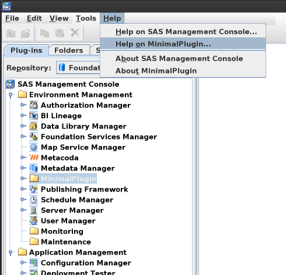

# minimal-plugin

A very minimal plug-in for SAS Management Console to demonstrate an issue with plug-in help
with SAS 9.4 M9.

## Building

If not already installed, download and install Apache Ant from https://ant.apache.org/
The ant.sh script assumes Ant is installed in /opt/ant/apache-ant-1.10.17 so update
ant.sh if installed elsewhere.

If not already installed, download and install a JDK version 11 or above. 
The ant.sh script assumes the JDK is installed in /opt/java/jdk-11.0.23+9 so update
ant.sh if installed elsewhere.

The build.properties file specifies the SASHOME directory for SAS 9.4 M9 as
/opt/sas94m9/sashome in property sas94m9.sashome so update this property if
SAS 9.4 M9 is installed elsewhere.  This location is used to source the 
required SAS JAR files from the SAS Versioned Jar Repository.
Compilation will fail if the required SAS JAR files cannot be found.

The plugin can be compiled using:
```
./ant.sh compile
```

The plugin can be deployed into the local SAS Management Console installation using:
```
./ant.sh deploy
```

NOTE: the user running Ant will need appropriate privileges to create the following
directories and files:

* SASHOME/SASManagementConsole/9.4/plugins/minimal/
* SASHOME/SASManagementConsole/9.4/plugins/minimal/minimal-plugin.jar

The plugin can be removed from the local SAS Management Console installation using:
```
./ant.sh undeploy
```

## Running

After deploying the plugin, launch SAS Management Console 9.4 M9. You should see MinimalPlugin in
the Plugins tab under the Environment Management node as shown and highlighted in the screenshot below.



Select the Help menu and the *Help on MinimalPlugin...* menu item as shown in the screenshot above.
It should launch a web browser with the ultimate URL https://documentation.sas.com/doc/en/minimalplugin/version/titlepage.htm
which will result in an HTTP 404 Page Not Found error.
This is to be expected as the custom plug-in does not originate from SAS Institute and so
help documentation would not be found on the documentation.sas.com site.
It would be useful if an alternative documentation URL could be specified for a custom plugin
or the *Help on* custom plugin menu item could be removed.
